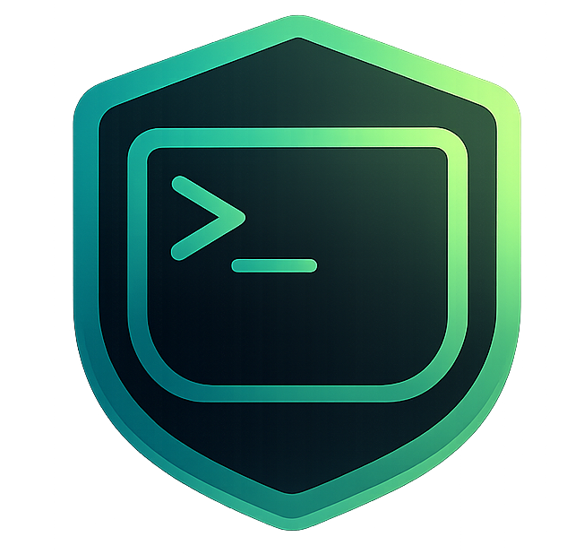

# moggsh



**SSH terminal for Android, built for vibe coding.**

Connect to your VPS, run commands while Claude thinks, navigate with a joystick, dictate with your mic. Everything you need for the AI coding loop from your phone. Free forever.

[moggsh.com](https://moggsh.com) · [Download APK](https://moggsh.com/moggsh.apk)

---

## Why

Most SSH apps on Android weren't designed for long vibe coding sessions. They lose your session when you switch apps, force you to open the keyboard every time you need Esc or an arrow key, and store private keys in plaintext.

moggsh fixes all three.

---

## Features

| | |
|---|---|
| **Joystick controls** | D-pad, Esc, Tab, Ctrl+C always visible — navigate vim, tmux, and history without switching keyboards |
| **Voice input** | Mic button for hands-free command dictation. Works offline. |
| **tmux detection** | On connect, finds running tmux sessions and offers one-tap reattach. Never lose a long-running agent. |
| **Background keep-alive** | Foreground service keeps SSH alive when you switch apps. Come back and the session is exactly where you left it. |
| **Biometric SSH keys** | Private keys encrypted with Android Keystore. Fingerprint or face unlock to use them. Nothing touches the clipboard. |
| **Multi-tab sessions** | Multiple SSH connections open simultaneously. |
| **SFTP browser** | Browse and transfer files on your server. |
| **Landscape split view** | Terminal + control panel side by side in landscape. |

---

## Tech stack

- **Flutter** (Dart) — cross-platform UI
- **dartssh2** — pure-Dart SSH client
- **xterm.js** (via WebView) — terminal emulator
- **flutter_secure_storage** + Android Keystore — encrypted key storage
- **speech_to_text** — offline voice input
- **Riverpod** — state management

---

## Build

```bash
# Prerequisites: Flutter SDK, Android SDK

cd moggsh_app
flutter pub get
flutter build apk --release
```

The release APK is at `build/app/outputs/flutter-apk/app-release.apk`.

---

## Project structure

```
moggsh_app/          # Flutter app
  lib/
    features/
      ssh/           # Connection management, SSH keys, server profiles
      terminal/      # Terminal widget, tabs, joystick, voice input
      sftp/          # File browser
      git_panel/     # Git shortcuts panel
      settings/      # App settings
    core/            # Theme, utilities

moggsh_web/          # Landing page (moggsh.com)
```

---

## License

Free to use. Open source.

---

Built with ♥ for developers who SSH from bed.
